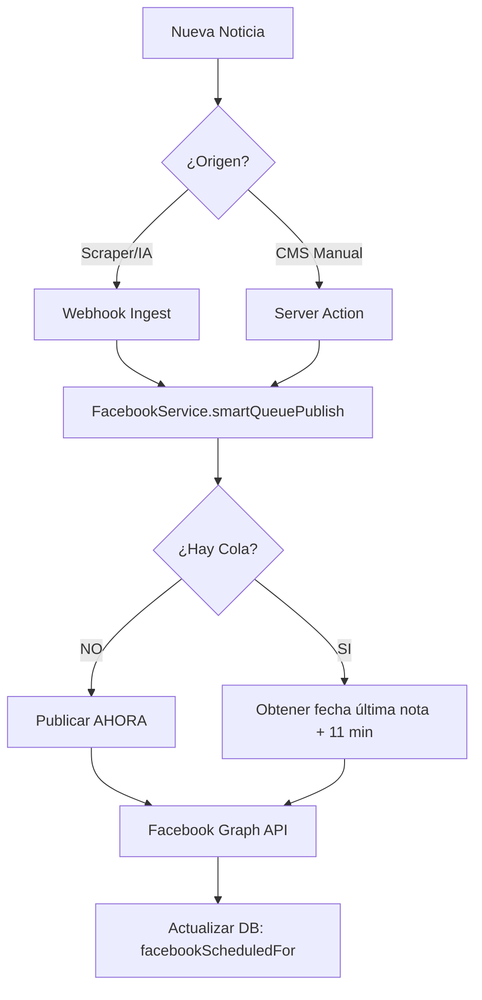

# 📘 Sistema de Integración Facebook (Smart Queue)

Este documento describe la arquitectura y funcionamiento del sistema **"Facebook Smart Queue"** implementado en REDCEN para la difusión automática de noticias.

## 🧠 ¿Qué es la "Cola Inteligente"?

Es un mecanismo de defensa y organización que impide la saturación de publicaciones en la Fanpage. En lugar de publicar todo inmediatamente (lo cual podría ser marcado como spam por Facebook o abrumar a los seguidores), el sistema organiza las noticias en una fila ordenada.

### La Regla de los 11 Minutos
El sistema verifica automáticamente la última publicación *programada* en el futuro.
1.  **Si la cola está vacía**: La nota se publica **inmediatamente**.
2.  **Si ya hay notas en espera**: La nueva nota se programa para **11 minutos después** de la última nota agendada.

---

## 📂 Componentes del Sistema

El sistema está modularizado en 4 partes clave dentro del código fuente:

### 1. El Cerebro (Servicio Principal)
*   **Archivo**: [`lib/services/facebook.ts`](../lib/services/facebook.ts)
*   **Responsabilidad**:
    *   Hospeda la clase `FacebookService`.
    *   Ejecuta la lógica de `smartQueuePublish` (decidir fecha/hora).
    *   Se comunica directamente con la **Graph API** de Facebook.
    *   Actualiza la base de datos con la fecha de programación real.

### 2. Los Disparadores (Triggers)
Son los eventos que activan el servicio.

*   **Ingesta Automática (Scraper/IA)**
    *   **Archivo**: [`app/api/webhooks/ingest/route.ts`](../app/api/webhooks/ingest/route.ts)
    *   **Función**: Cuando el sistema detecta una noticia nueva externa, intenta publicarla automáticamente si cumple las condiciones.
    
*   **Creación Manual (CMS)**
    *   **Archivo**: [`actions/notes.ts`](../actions/notes.ts)
    *   **Función**: Cuando un redactor humano crea una nota desde el panel de administración y marca "Publicar", el sistema también la envía a la cola de Facebook.

### 3. Utilidades de Prueba
*   **Archivo**: `scripts/local/test-fb.ts` (Ignorado por Git)
*   **Función**: Script aislado que permite a los desarrolladores probar la conexión y credenciales de Facebook sin necesidad de crear contenido real en la base de datos.

### 4. Configuración
*   **Archivo**: `.env`
*   **Variables Requeridas**:
    *   `FB_PAGE_ID`: El identificador numérico de la Fanpage.
    *   `FB_PAGE_ACCESS_TOKEN`: El token de seguridad con permisos `pages_manage_posts` y `pages_read_engagement`.

---

## 🔄 Flujo de Datos

